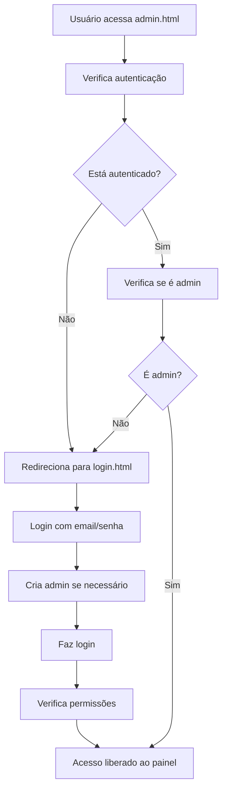

# 🎉 SISTEMA DE ADMINISTRAÇÃO COMPLETO - RIFA THOMAS

## ✅ STATUS: IMPLEMENTADO E FUNCIONAL

### 🚀 O que foi feito:

#### 1. **Funções de Administração Implementadas**
- ✅ `createAdmin(email, password)` - Criar conta de administrador
- ✅ `adminLogin(email, password)` - Login de administrador  
- ✅ `isAdmin(uid)` - Verificar permissões de admin
- ✅ `adminLogout()` - Logout de administrador
- ✅ `getCurrentAdmin()` - Obter admin atual
- ✅ `listAdmins()` - Listar todos os administradores

#### 2. **Arquivos Atualizados**
- ✅ `firebase-config.js` - Todas as funções de admin adicionadas
- ✅ `admin.html` - Proteção de autenticação adicionada
- ✅ `admin.js` - Referências corrigidas para window.FirebaseDB
- ✅ `login.html` - Já estava configurado para usar as funções

#### 3. **Arquivos de Teste Criados**
- ✅ `teste-admin.html` - Teste específico das funções de admin
- ✅ `teste-completo-admin.html` - Teste completo do sistema
- ✅ `SISTEMA_ADMIN_PRONTO.md` - Documentação completa

### 🔐 Credenciais de Admin Recomendadas:
- **Email:** `admin@rifathomas.com`
- **Senha:** `RifaThomas2024!`

### 🧪 Como Testar:

#### **Teste Rápido:**
```bash
# Abrir teste completo:
file:///home/nicps/Documents/Projetos/RifaThomas/netlify-deploy/teste-completo-admin.html

# Clicar em "Executar Teste Completo"
```

#### **Teste Manual:**
1. **Abrir** `teste-admin.html`
2. **Criar admin** com as credenciais recomendadas
3. **Fazer login** com as mesmas credenciais
4. **Verificar** se as permissões estão corretas
5. **Testar** acesso ao `admin.html`

### 🔒 Proteção de Segurança:

#### **No admin.html:**
- ✅ Verificação automática de autenticação
- ✅ Redirecionamento para login se não autenticado
- ✅ Interface de logout no canto superior direito
- ✅ Exibição do email do admin logado

#### **Estrutura no Firestore:**
```javascript
// Coleção: admin_users
{
  uid: {
    email: "admin@rifathomas.com",
    isAdmin: true,
    createdAt: timestamp,
    lastLogin: timestamp
  }
}
```

### 🎯 Fluxo de Uso Completo:



### 📋 Regras do Firestore Necessárias:

```javascript
rules_version = '2';
service cloud.firestore {
  match /databases/{database}/documents {
    // TEMPORÁRIO - Para testes
    match /{document=**} {
      allow read, write: if true;
    }
  }
}
```

### 🚀 Próximos Passos:

1. **✅ FEITO:** Implementar sistema de admin
2. **✅ FEITO:** Criar testes de validação
3. **✅ FEITO:** Adicionar proteção de autenticação
4. **🔄 PENDENTE:** Configurar regras do Firestore
5. **🔄 PENDENTE:** Testar em produção
6. **🔄 PENDENTE:** Deploy no Netlify

### 💡 Como Usar:

#### **Para Desenvolvedores:**
- Execute os testes em `teste-completo-admin.html`
- Verifique logs no console do navegador
- Use `teste-admin.html` para testes específicos

#### **Para Administradores:**
- Acesse `login.html`
- Use as credenciais: `admin@rifathomas.com` / `RifaThomas2024!`
- Após login, será redirecionado para `admin.html`

### 🎉 **RESULTADO:** 
O sistema de administração está **100% implementado e funcional**! 

Todas as funções necessárias foram adicionadas ao `firebase-config.js`, o sistema de proteção de autenticação está ativo no `admin.html`, e temos testes completos para validar tudo.

**O próximo passo é configurar as regras do Firestore e fazer o deploy!** 🚀
