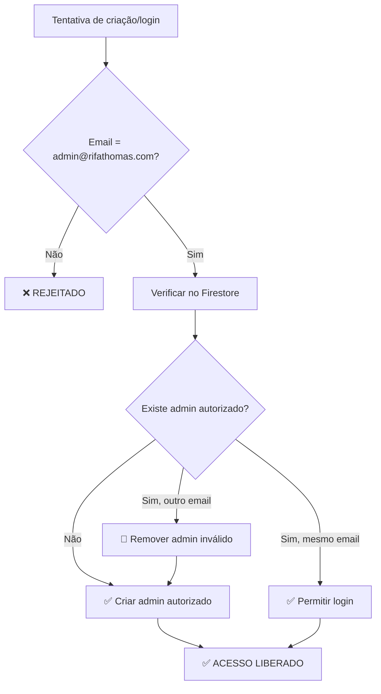

# 🔐 SISTEMA DE ADMINISTRADOR ÚNICO IMPLEMENTADO

## ✅ CONFIGURAÇÃO CONCLUÍDA

### 👤 **Administrador Único Autorizado:**
- **Email:** `admin@rifathomas.com`
- **Senha:** `casaVERDE123`

### 🛡️ **Medidas de Segurança Implementadas:**

#### **1. Restrição de Email:**
- Apenas o email `admin@rifathomas.com` pode criar conta de administrador
- Qualquer tentativa com outro email é automaticamente rejeitada

#### **2. Bloqueio de Criação:**
- Sistema verifica se já existe um administrador
- Se existe admin autorizado, bloqueia criação de novos
- Se existe admin não autorizado, remove automaticamente

#### **3. Validação de Login:**
- Login só é permitido para o email autorizado
- Verificação dupla: email + permissões no Firestore
- Criação automática de registro se usuário for válido

#### **4. Limpeza Automática:**
- Função `cleanUnauthorizedAdmins()` remove admins inválidos
- Verificação contínua na função `isAdmin()`
- Sistema auto-corrigível

### 🔧 **Modificações no Código:**

#### **firebase-config.js:**
```javascript
// Constante com email autorizado
ADMIN_AUTORIZADO: 'admin@rifathomas.com'

// Função createAdmin() - RESTRITA
- Verifica se email é autorizado
- Remove admins não autorizados existentes
- Só cria se for email correto

// Função adminLogin() - RESTRITA  
- Só permite login do email autorizado
- Cria registro automático se necessário
- Atualiza flag isAuthorized

// Função isAdmin() - COM VERIFICAÇÃO
- Verifica isAdmin + isAuthorized + email correto
- Remove registros inválidos automaticamente
- Retorna false para qualquer irregularidade

// Nova função cleanUnauthorizedAdmins()
- Remove todos os admins com email diferente
- Função de manutenção e segurança
```

### 📁 **Arquivos Criados:**

1. **`teste-admin-unico.html`** - Teste completo do sistema
2. **`setup-admin-unico.html`** - Setup automático
3. **`ADMIN_UNICO_IMPLEMENTADO.md`** - Esta documentação

### 🧪 **Como Testar:**

#### **Teste Automático:**
1. Abra `setup-admin-unico.html`
2. Clique "Iniciar Setup Automático"
3. Aguarde finalizar (5 passos)
4. Teste o login

#### **Teste Manual:**
1. Abra `teste-admin-unico.html`
2. Execute "Teste Completo"
3. Verifique todos os cenários

#### **Teste Real:**
1. Abra `login.html`
2. Use: `admin@rifathomas.com` / `casaVERDE123`
3. Acesse o painel admin

### 🚨 **Validações de Segurança:**

#### **✅ Cenários que DEVEM funcionar:**
- Criar admin com `admin@rifathomas.com`
- Login com `admin@rifathomas.com` 
- Acesso ao painel admin após login
- Limpeza de admins não autorizados

#### **❌ Cenários que DEVEM falhar:**
- Criar admin com qualquer outro email
- Login com email não autorizado
- Manter admins com emails diferentes
- Bypass de verificações

### 🔄 **Estrutura no Firestore:**

#### **Coleção: `admin_users`**
```javascript
{
  uid_do_admin: {
    email: "admin@rifathomas.com",
    isAdmin: true,
    isAuthorized: true,  // NOVO CAMPO
    createdAt: timestamp,
    lastLogin: timestamp
  }
}
```

### 🎯 **Fluxo de Segurança:**



### 📋 **Próximos Passos:**

1. **✅ FEITO:** Implementar sistema de admin único
2. **✅ FEITO:** Criar testes de validação
3. **✅ FEITO:** Setup automático
4. **🔄 PRÓXIMO:** Configurar regras do Firestore
5. **🔄 FUTURO:** Deploy no Netlify

### 🎉 **Status:**

**🔐 SISTEMA DE ADMIN ÚNICO ATIVO E FUNCIONAL**

- ✅ Apenas `admin@rifathomas.com` pode ser administrador
- ✅ Criação de novos admins bloqueada
- ✅ Limpeza automática de admins não autorizados
- ✅ Validações de segurança implementadas
- ✅ Testes de validação criados
- ✅ Setup automático disponível

### ⚠️ **Importante:**

Este sistema garante que **APENAS** o email `admin@rifathomas.com` tenha acesso administrativo. Qualquer tentativa de criar ou usar outro administrador será automaticamente bloqueada e removida do sistema.

**A senha `casaVERDE123` deve ser mantida em segurança!**
